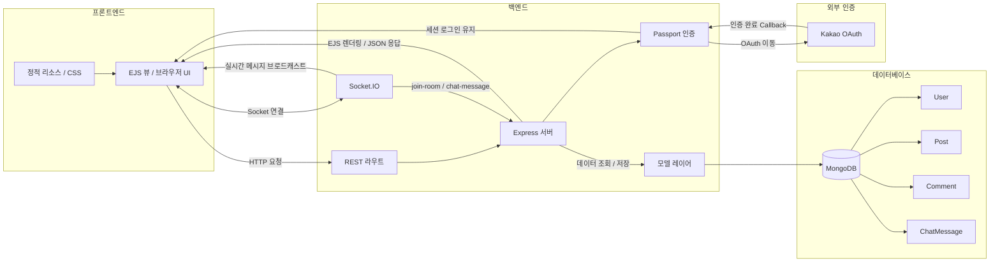
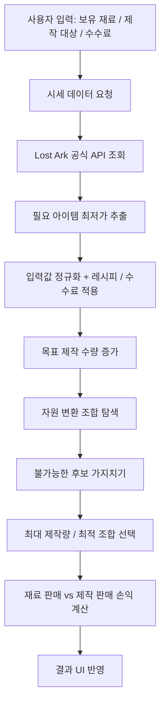

안녕하세요, 김관호입니다

AI 기반 실시간 협업 시스템 개발에 관심을 가진 백엔드 개발자입니다.
서버에서의 데이터 흐름을 설계하고, 클라이언트와의 통신을 처리하는 과정에 흥미를 느껴 백엔드 개발에 집중하고 있습니다.

특히 WebSocket을 활용한 실시간 데이터 처리와 AI 기반 기능 자동화에 관심이 있으며,
이를 실제 서비스에 적용하는 경험을 중심으로 개발 역량을 키워왔습니다.

---

## 연락처

* GitHub: https://github.com/Gwanhoo
* Email: [kimgwanho0206@gmail.com](mailto:kimgwanho0206@gmail.com)

---

## 기술 스택

### Backend

* [Node.js / Express](https://github.com/Gwanhoo/backend-learning-log/blob/main/backend/README.md)
  : REST API 설계 및 서버 구조 설계

### Realtime

* [WebSocket (Socket.io)](https://github.com/Gwanhoo/backend-learning-log/blob/main/websocket/README.md)
  : 실시간 데이터 동기화 및 채팅 기능 구현

### Database

* [MongoDB](https://github.com/Gwanhoo/backend-learning-log/blob/main/database/README.md)
  : 컬렉션 설계 및 CRUD 데이터 처리

### AI

* OpenAI API: 작업 분해(Task Decomposition) 기능 구현

### Frontend

* React / Next.js: 컴포넌트 기반 UI 설계 및 상태 관리, 페이지 라우팅 구현
* Tailwind CSS: 반응형 UI 스타일링 및 디자인 시스템 적용

---

# 프로젝트

## 1. AI 기반 실시간 협업 칸반 시스템

### 소개
LLM(OpenAI API)을 활용하여 작업(Task)을 자동 분해하고,  
WebSocket 기반 실시간 협업 기능을 제공하는 칸반 프로젝트 관리 시스템 구현

### 주요 기능
- OpenAI API 기반 Task Decomposition 기능 구현
- WebSocket(Socket.io)을 활용한 실시간 채팅 및 상태 동기화
- 프로젝트 / 태스크 / 멤버 CRUD 기능 구현
- 프로젝트 초대 및 협업 기능 구현
- 칸반 보드 기반 태스크 상태 관리 구현

### 기술적 특징
- Socket.io Room 기반 프로젝트 단위 실시간 통신 구조 설계
- REST API + WebSocket 혼합 구조를 통한 데이터 흐름 설계
- MongoDB 스키마 분리를 통한 프로젝트/멤버/메시지 데이터 관리
- 실시간 이벤트 중복 처리 및 상태 동기화 문제 해결
- Next.js 기반 컴포넌트 단위 UI 구조 설계 및 상태 관리 적용

### 사용 기술
- Frontend: React, Next.js, Tailwind CSS
- Backend: Node.js, Express
- Database: MongoDB, Mongoose
- Realtime: Socket.io
- AI: OpenAI API

GitHub:  
https://github.com/Gwanhoo/Capstone-Design

```mermaid
flowchart LR
    %% 프론트엔드 영역
    subgraph Frontend["프론트엔드 (Next.js)"]
        direction TB
        UI["대시보드 / 프로젝트 보드"]
        Auth["인증 (Auth)"]
        API_C["API 클라이언트"]
        Socket_C["소켓 클라이언트"]
    end

    %% 백엔드 영역
    subgraph Backend["백엔드 (Express 서버)"]
        direction TB
        REST["REST API 계층"]
        Socket_G["Socket.io 게이트웨이"]
        Service["서비스 계층 (비즈니스 로직)"]
    end

    %% 데이터베이스 영역
    subgraph Database["데이터베이스 (MongoDB)"]
        direction TB
        M_Proj["프로젝트 모델"]
        M_Task["작업(Task) 모델"]
        M_User["사용자(Member) 모델"]
        M_Chat["채팅(Message) 모델"]
    end

    %% 외부 API 영역
    subgraph External["외부 API"]
        OpenAI["OpenAI API"]
    end

    %% 메인 데이터 흐름 (큰따옴표로 특수문자 이스케이프 처리)
    API_C <-->|"CRUD 요청/응답"| REST
    Socket_C <-->|"실시간 동기화 (WebSockets)"| Socket_G
    
    REST --> Service
    Socket_G --> Service
    
    Service <-->|"데이터 읽기/쓰기"| Database
    Service <-->|"작업 자동 분할 및 우선순위 지정 요청"| OpenAI

    %% 작업 분할(Task Decomposition) 상세 흐름
    subgraph Flow["AI 작업 분할(Decomposition) 파이프라인 (projectId 기준)"]
        direction LR
        Goal["프로젝트 프롬프트 입력"] --> AI_Proc["OpenAI 분석 (하위 작업 분할 및 우선순위 지정)"] 
        AI_Proc --> Create["세부 작업 생성"] 
        Create --> Store["MongoDB 저장"] 
        Store --> Broad["프로젝트 룸 소켓 브로드캐스트"] 
        Broad --> Update["클라이언트 UI 업데이트"]
    end
    
    %% 스타일링 (GitHub README 최적화용 블루 포인트 컬러)
    classDef default fill:#f8f9fa,stroke:#dee2e6,stroke-width:2px,color:#212529;
    classDef highlight fill:#e7f1ff,stroke:#0d6efd,stroke-width:2px,color:#084298;
    classDef db fill:#d1e7dd,stroke:#198754,stroke-width:2px,color:#0f5132;
    classDef api fill:#fff3cd,stroke:#ffc107,stroke-width:2px,color:#664d03;

    class Frontend,Backend highlight;
    class Database db;
    class External,Flow api;
```

---

## 2. 코사모 (코딩할 사람들의 모임)

### 소개
개발자 커뮤니티를 목표로 한 웹 서비스로,  
실시간 채팅과 사용자 간 커뮤니케이션 기능 중심으로 구현

### 주요 기능
- Socket.io 기반 실시간 채팅 기능 구현
- 사용자 / 게시글 / 댓글 CRUD 기능 구현
- 카카오 OAuth 로그인 기능 적용
- 사용자 인증 및 세션 관리 구현

### 기술적 특징
- 이벤트 기반 실시간 채팅 구조 설계
- REST API 기반 게시글 및 사용자 데이터 관리
- OAuth 인증 흐름 및 로그인 상태 처리 경험
- 프론트엔드와 백엔드 분리 구조 기반 서비스 구현

### 사용 기술
- Frontend: React
- Backend: Node.js, Express
- Database: MongoDB
- Realtime: Socket.io
- Auth: Kakao OAuth

GitHub:  
https://github.com/Gwanhoo/My_BackEnd_CRUD_Project

- 코사모는 Express 기반 서버 렌더링(EJS) 구조 위에서 REST 라우팅과 Socket.IO를 함께 사용하는 개발자 커뮤니티 서비스입니다.
- 일반 기능(인증, 게시글, 댓글, 프로필)은 REST API와 MongoDB CRUD로 처리하고, 채팅은 Socket.IO 이벤트(`join-room`, `chat-message`)를 통해 실시간 동기화합니다.
- 사용자 인증은 Passport(Local + Kakao OAuth) 기반이며, 핵심 데이터(`User`, `Post`, `Comment`, `ChatMessage`)는 MongoDB에 저장됩니다.

---

## 3. 아비도스 제작 최적화 계산기

### 소개
게임 내 자원 제작 구조를 분석하여,  
제한된 재료 기준 최대 생산량을 계산하는 최적화 계산기 구현

### 주요 기능
- 자원 변환 규칙 기반 생산량 계산 기능 구현
- 입력값 변화에 따른 실시간 결과 반영
- 최적 제작 조합 계산 로직 구현

### 기술적 특징
- Brute Force + 가지치기 기반 탐색 알고리즘 설계
- 복잡한 자원 변환 조건을 그래프 형태로 구조화
- 연산량 감소를 위한 조건 기반 탐색 최적화 적용
- 사용자 입력 변화에 따른 동적 계산 구조 구현

### 사용 기술
- Frontend: React, Next.js
- Styling: Tailwind CSS
- Deployment: Vercel

GitHub:  
https://github.com/Gwanhoo/abydos_app

배포:  
https://abydos-app.vercel.app/

### 4. LinkShop (쇼핑몰 서비스)

* 상품 관리 기능 중 **수정/삭제 페이지 UI 구현 담당**

**기술적 기여**

* 사용자 입력 기반 데이터 수정/삭제 UI 구현
* 상태 변경에 따른 화면 업데이트 처리
* 폼 입력 처리 및 기본적인 유효성 검증 구현

GitHub: https://github.com/Sprint-11-4team/sprint-linkshop
배포: https://project-linkshop.netlify.app

---

### 5. Linkbrary (링크 공유 서비스)

* **로그인 / 회원가입 페이지 UI 구현 담당**

**기술적 기여**

* 로그인 / 회원가입 화면 UI 구현
* 입력값 상태 관리 및 폼 처리 로직 구현
* 기본적인 입력 검증 처리

GitHub: https://github.com/codeit-fe11-part3-team4/linkbrary.git
배포: https://fe11-team4-linkbrary.netlify.app/

---

### 6. Coworkers (협업 서비스 랜딩페이지)

* **메인 랜딩 페이지 UI 구현 담당**

**기술적 기여**

* 주어진 디자인을 기반으로 랜딩 페이지 UI 구현
* 컴포넌트 단위 구조 분리 및 재사용성 고려
* Tailwind CSS 기반 스타일링 적용

GitHub: https://github.com/fe11-part4-team3/coworkers.git
배포: https://coworkers.netlify.app/ (현재 배포 중지)

---
